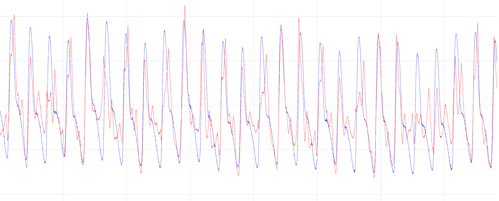

# Reproduction_of_wavelet_denoising_1
Reproduction of paper, all by my own with out professor advising, spend me a whole day. This is my first try in a journal, i guess i do my best, written this code in twice(first one got a bug but i can't find out, so i write a new one). The truth is, my code didn't work well, The signal is somewhat distorted and the noise is not effectively removed. This may or may not be a coincidence.

### Conclusion and analysis of my data result：

The red line is the denoised signal and blue one is the row signal. As you can see, many peak value of denoised signal is higher than row signal's. I guess that is a **result of thresholding the positive and negative coefficients separately**, that is, in some dec-level, only the negative coefficients has been set to 0 due to the hard thresholding in some location, but those positive coefficients from other dec-level but in the same location are not changed. So as why some magnitude in red one is lower than blue one. It may also be due to the fact that the **same sample mean and sample variance are used for both thresholds for positive and negative parameters**.

Any algorithm that assumes some aspects of its superiority inevitably assumes certain risks. that's what i have learned in my algorithm class. But more evidence would need to be experimented with to come up with it. but whatever, i will keep going. 

#### REFERENCE: Srivastava, M., Anderson, C. L., & Freed, J. H. (2016). A new wavelet denoising method for selecting decomposition levels and noise thresholds. IEEE access, 4, 3862-3877.

Thanks to this paper and his author.
